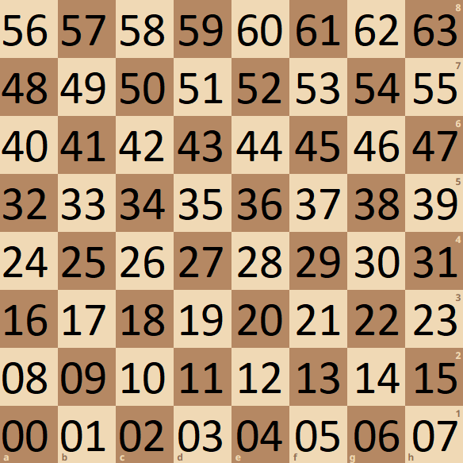

Die globale Variable `g_swaps` stellt für jede Spiegelungsart ein Dictionary zu Verfügung.
Diese Dictionaries besitzen als `key` und `value` ein `chess.Square`. 
Der `key` steht dabei für die ursprüngliche Position und der `value` für die gespiegelte Position.

Um die bitweisen Operationen für die Spiegelungen nachvollziehen zu können, gilt es sich zunächst die Nummerierung der
Felder zu betrachten:

Bei der binären Betrachtung der Schachfelder kann man speziell in den Ecken ein Muster erkennen:
* (0)10 = (000000)2
* (7)10 = (000111)2
* (56)10 = (111000)2
* (63)10 = (111111)2

Anhand dieser Darstellungen haben sich speziell für die horizontale und vertikale Spiegelungen folgende binäre Operationen gefunden.
> Horizontale Spiegelung: mirrored = square ^ 56  
> Vertikale Spiegelung: mirrored = square ^ 7

Diese Formeln haben sich daraus ergeben, dass die 3 niederwertigsten Bit für die Position der Spalte und die 3 höherwertigen Bits für die Position der Zeile verwendet werden. 

Aus dieser Erkenntnis konnten auch die Spiegelungen an den Diagonalen gefolgert werden. 
Die Spiegelung an der aufsteigenden Diagonalen (0-9-18-27-36-45-54-63) hat zur Folge, dass die Indizes der Zeile und Spalte miteinander vertauscht werden.
Die binäre Operation hierfür lautet:
> Spiegelung an aufsteigenden Diagonalen: mirrored = ((square >> 3) | (square << 3)) & 63

Bei dieser Formel stellt der Teil `& 63` sicher, dass wir die zur Beschreibung des Feldes nötigen Bits nicht überschreiten.

Für das Spiegeln an der fallenden Diagonalen (56-49-42-35-28-21-14-07) kann das Spiegeln an der aufsteigenden Diagonalen genutzt werden.
Zu dieser Spiegelung kommt noch die Spiegelung anhand der vertikalen und horizontalen Achse (Umsetzung mit `^ 63`) hinzu.
Die Kombination dieser Operationen führt zur Spiegelung an der abfallenden Diagonalen. Dementsprechend lautet die Formel für die Spiegelung:
> Spiegelung an abfallenden Diagonalen: mirrored = (((square >> 3) | (square << 3)) & 63) ^ 63

Anhand dieser zuvor beschriebenen Spiegelmethoden ist es zusätzlich noch möglich die Rotationen um 90°, 180°, 270° darzustellen, da diese ebenfalls durch mehrfache Spiegelungen umgesetzt werden könnte.
Beispielsweise ist die Drehung um 180° eine Spiegelung sowohl an der vertikalen, als auch horizontalen Ebene.
Die restlichen Operationen können aus der Variablen `g_swaps` entnommen werden.